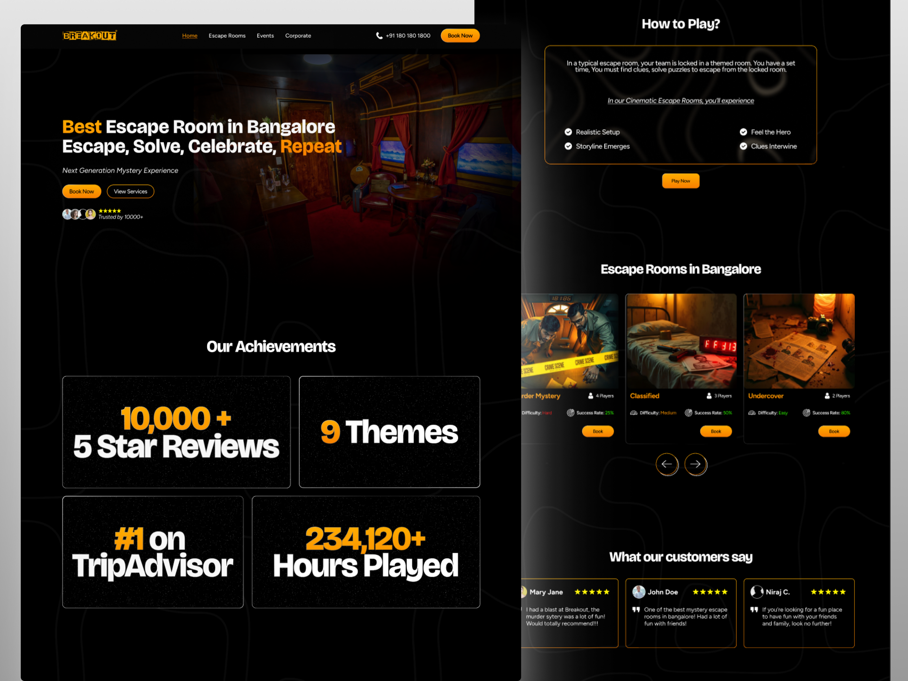

# 🎯 Breakout – Escape Room Landing Page Design

Breakout is an engaging redesign of the landing page for an escape room website, focusing on a dark theme and intuitive user experience. This project highlights the exciting adventure theme through visually appealing elements and clear calls-to-action for an immersive first impression.

## 🚀 Features  

✅ Landing Page – A dark-themed, visually immersive introduction to Breakout Escape Room
✅ Intuitive Navigation – Clear, user-friendly layout to guide users effortlessly
✅ Call-to-Action Sections – Strategically placed CTAs to drive user interaction and bookings
✅ Visual Appeal – Bold imagery and engaging design elements reflecting the escape room experience

## 🖌️ Tech Stack  
- **Design**: Figma

## 🎨 Screenshots  

### 📍 Landing Page  
 
 

